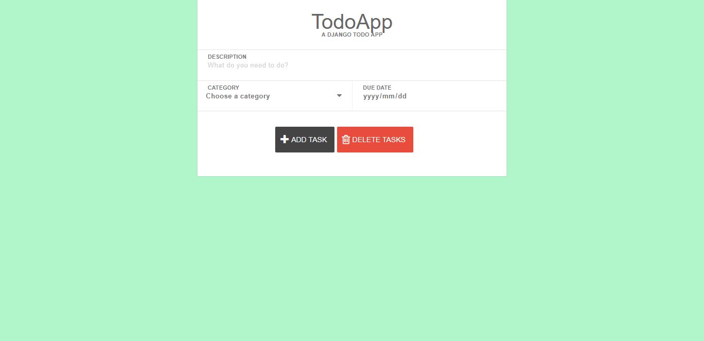

# todo_app
django-todo is a pluggable, multi-user, multi-group task management and assignment application for Django, designed to be dropped into an existing site as a reusable app. django-todo can be used as a personal to-do tracker, or a group task management system, or a ticketing system for organizations (or all of these at once!)

